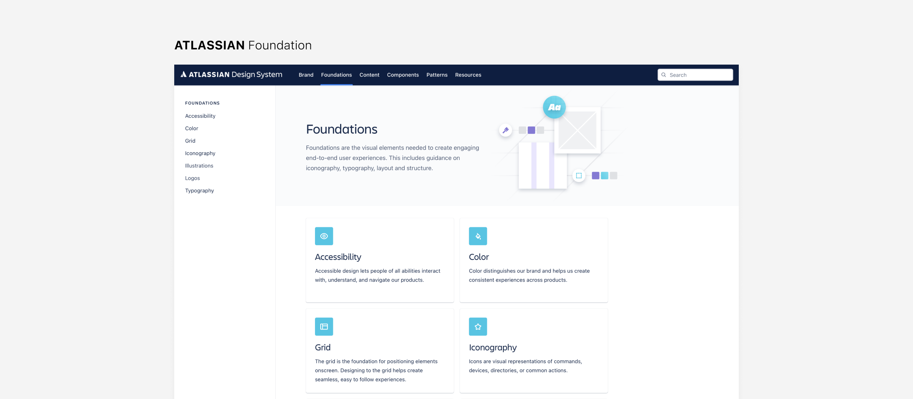

   
2022.02.
{: .fs-3 }

- 본 글에서는 GUI가 아닌 사용자 경험 분석 쪽에 치우친 디자인 영역에 한하여 UX 디자인이라 칭합니다.
- UX 디자이너로써 디자인 시스템 프로젝트에 참여하며 느낀 생각을 정리한 글입니다.  
{: .fs-3 }

---

## Table of contents
{: .no_toc .text-delta }

- TOC
{:toc}

---

 

# Design System for UX

## 01 Design System

디자인 시스템을 간단히 설명하면 **서비스에서 반복적으로 사용하는 GUI 요소들을 따로 모아 구성한 컬렉션**으로, 여러 구성원들이 서비스를 일관되고 효율적으로 함께 디자인・개발하기 위한 시스템이다. 굳이 시스템까지 만들어서 관리해야 할까 싶기도 하지만, 서비스의 크기가 커지고 여러 명의 작업자가 동시에 작업을 하기에 앞서 ‘같은 서비스를 만들기 위한 하나의 디자인 언어를 만드는 것이다’라 생각하면 사실 서비스 입장에선 불가피한 일이다. 

디자인 시스템의 목적과 효과는 크게 두 가지로 나눌 수 있는데,  
- **외부적**으로는 일관된 사용자 경험을 제공하여 하나의 브랜딩을 유지하기 위함이고,
- **내부적**으로는 모든 관계자들이 하나의 팀으로, 공통된 디자인 언어로 소통하여 효율성을 극대화하기 위함이다.

디자인시스템의 대표적인 구성
{: .fs-2 }
{: .text-center}

  
즉, 디자인 시스템은 디자이너뿐만 아니라 개발자, 리서쳐, 프로덕트 매니저 등이 **모두 하나의 팀으로써 협업하기 위한 도구**이고, 공통된 언어로 **최대한의 효율을 내기 위한 도구**이다. 이런 도구로써의 디자인 시스템은 
1. 여러 화면과 콘텍스트에서 반복적으로 사용되는 UI 컴포넌트로 구성되며, 
2. 모든 컴포넌트는 대규모로 복제가 가능해야 하고,
3. 여러 팀에 공유될 수 있는 포맷이고,
4. 특정하고 확실한 기준에 의해 작성되어야 한다.

 

## 02 UX in Design System

화면을 구성하는 GUI 컬렉션이라는 개념으로 디자인 시스템을 바라본다면, 디자인 시스템을 개발하는 과정에서 UX 디자이너는 어떤 역할을 가질 수 있을까?

실제로 기업들의 디자인 시스템을 보면 하나의 디자인 언어를 맞추자는 의미에서 Foundation에 속하는 Typography, Color, Layout 등의 기본적인 GUI 규칙을 먼저 정의하고, 이러한 기초 요소들에 대한 정리를 바탕으로 버튼, 카드, 헤더 등과 같은 자주 사용되는 컴포넌트들로 확장한 백과사전을 보는 듯하다.

Color, Typography와 같이 기초 요소로 구성되어 있는 Atalassian의 Foundation
{: .fs-2 }
{: .text-center}

 

이렇다 보니 디자인 시스템의 결과물들이 비주얼적인 성격이 매우 강해 보이고, 이러한 작업을 시작하며 UX 디자이너로서 해야 하는 일에 대해 혼란을 느끼기 쉽다. 단순히 시각적 규칙을 만들어야 하는 것인지, 반복되는 컴포넌트를 모아 정리하는 역할일 뿐인 것인지, 직접 시각 요소를 다루지 않는 이상 무언가 부차적인 역할로만 느껴지고 특별히 주체성을 가지기 쉽지 않다.

앱에서 사용하는 컴포넌트 리스트로 구성되어 있는 Google Material Design의 Components
{: .fs-2 }
{: .text-center}

 

하지만 조금만 더 깊이 생각해본다면 모든 GUI 구성요소들은 브랜드의 공통된 디자인 원칙과 UX 전략에 의해 구조화된 것으로, 사실 그 내면에서 UX 디자이너가 해야 할 일이 꽤 많다. 단편적인 심미적 요소 사전이 아니라 전체적으로 사용자가 가지게 될 일관된 경험을 잡아주어야 한다. 디자인 시스템이 단순히 현존하는 요소들을 모아 리스트업 하는 형태가 되지 않도록, 현재의 요소들을 헤쳐 모아 해석하고 재분류하는 과정에서 어떠한 뚝심과 중심을 가지고 방향성을 잡아야 하는 것이 UX 디자이너의 역할이 된다.

하나의 버튼 컴포넌트의 모양과 색을 정의하는 과정을 보자. 서비스 전반적으로 몇 단계의 인터랙션을 제공하고 있는지에 따라 Disabled-Default-Hover-Pressed와 같은 단계 별 컴포넌트를 정리할 수 있으며, 모바일 ・ PC와 같이 다른 Input을 가진 플랫폼에 따라 이러한 액션 단계의 변화까지 모두 앞단에서 모두 정의가 되어 있어야 한다.

하나의 버튼을 세부 요소로 분해하고, 사용자 인풋의 상태를 정의하여 설명하는 Google Material Design
{: .fs-2 }
{: .text-center}

 

최종 결과물이 컴포넌트 리스트라 하더라도, 그 컴포넌트를 일관되고 효율적으로 작업하는 기반에는 일관된 경험이 있다. 모든 비주얼 요소들은 하나의 원칙으로 제작되어야 하며, 여기에 UX 디자이너의 역할이 있다. 초반에 중심을 잡지 못하고 여러 번 헤맸던 경험을 토대로, 디자인 시스템 가이드를 제작하며 UX 디자이너가 가질 수 있는 가장 기본적인 역할들을 정리해보고자 한다.

 
 
 